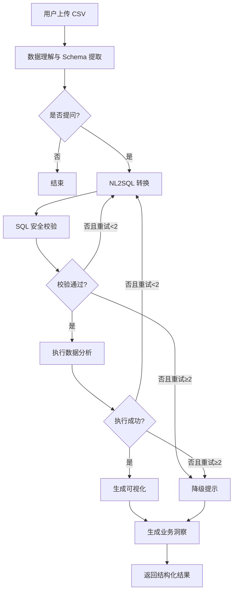

# Data Analysis Agent
基于 LangGraph + FastAPI 构建的数据分析智能体。支持用户上传 CSV 数据，通过自然语言提问，Agent 自动完成 NL2SQL、数据查询、可视化生成以及业务洞察输出。
## 项目背景

在传统数据分析场景中，业务人员依赖数据分析师编写 SQL 获取数据，沟通成本高、响应周期长。本项目旨在通过大语言模型（LLM）赋能，打造一个支持自然语言交互的数据分析智能体，降低数据消费门槛，实现“即问即答”的数据洞察体验。
## 核心特性
- **NL2SQL 智能转换**：理解用户自然语言意图，结合数据表结构自动生成对应 SQL。
- **SQL 纠错闭环**：当生成的 SQL 执行报错时，利用 LangGraph 的条件边将错误信息退回生成节点重新生成，最多重试 2 次，显著提升执行成功率。
- **自动化可视化**：根据查询结果的数据特征（时序、分类、占比等），自动匹配最佳图表类型并生成 Plotly 交互式 JSON。
- **结构化业务洞察**：使用 Pydantic 模型约束大模型输出，提供包含总结、核心发现和业务建议的结构化报告，便于前端渲染。
- **多轮对话记忆**：基于会话 ID 维护上下文状态，支持针对前序结果进行连续追问分析。
- **安全防护机制**：内置 SQL 危险关键字过滤与查询行数强制限制，防止恶意操作与内存溢出。
## 系统架构

## 技术栈
| 分类 | 技术选型 | 说明 |
| :--- | :--- | :--- |
| **Agent 编排** | LangGraph | 状态机驱动的工作流，支持条件路由与循环纠错 |
| **Web 框架** | FastAPI | 高性能异步 API 框架 |
| **大模型交互** | LangChain, OpenAI | LLM 应用开发框架与模型底座 |
| **数据处理** | Pandas, SQLAlchemy | 数据清洗、分析及 SQL 执行 |
| **数据可视化** | Plotly | 生成交互式图表 JSON |
| **数据校验** | Pydantic | 规范化输入输出数据结构 |
## 快速开始
### 环境准备
- Python 3.11+
- 提供 OpenAI API Key (或兼容接口的 Key)
### 部署步骤
1. **克隆项目**
   ```bash
   git clone https://github.com/AaanO312/data-analysis-agent.git
   cd data-analysis-agent
   ```
2. **安装依赖**
   ```bash
   pip install -r requirements.txt
   ```
3. **配置环境变量**
   ```bash
   cp .env.example .env
   # 编辑 .env 文件，填入 OPENAI_API_KEY 等配置
   ```
4. **启动服务**
   ```bash
   # 直接运行
   python run.py
   
   # 或使用 Docker 运行
   docker-compose up -d
   ```
5. **访问接口**
   启动后访问 `http://localhost:8000/docs` 查看 API 文档并进行接口测试。
## 项目结构
```
data-analysis-agent/
├── agents/                  # Agent 核心逻辑
│   ├── graph.py             # LangGraph 状态图定义与编译
│   ├── nodes.py             # 核心节点实现 (NL2SQL, 执行, 可视化等)
│   ├── state.py             # 状态管理定义
│   └── few_shot.py          # Few-shot 示例 Prompt
├── core/                    # 核心配置 (日志, 安全, 配置加载)
├── tools/                   # 工具函数 (SQL 执行引擎, 数据清洗)
├── schemas/                 # Pydantic 数据模型
├── prompts/                 # 提示词模板管理
├── sample_data/             # 测试用 CSV 数据
├── app.py                   # FastAPI 应用与路由定义
├── main.py                  # 程序主入口
├── run.py                   # 启动脚本
├── Dockerfile               # 容器化配置
└── docker-compose.yml       # 编排配置
```
